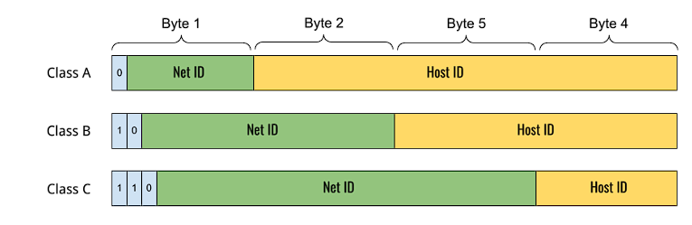

# WORK HARD FIGHT EASY

- 

네트워크

# TCP-IP 4계층

# OSI 7계층

# IP/CIDR

## IP

- IP는 네트워크 내 서로 연결된 장치들을 식별하기 위한 주소체계입니다.

- 마침표를 구분자로 하는 4개의 숫자로 구성되어 있으며 `255.255.255.255`와 같이 표현합니다.

- 종단 장치와 라우터를 포함해 모든 장치는 고유의 IP를 가지며 이를 통해서 서로 통신합니다.

### IP 버전

- IP는 32비트의 크기를 가지는 IPv4와 128비트의 크기를 가지는 IPv6가 있습니다. 일반적으로 버전을 생략하고 IP라고 한다면 IPv4를 의미합니다.

### IP 클래스

- IP는 많은 수의 주소를 표현할 수 있습니다. 그래서 그것을 관리하기 위해 IP 클래스로 구조화합니다.

- A, B, C, D, E의 5개 클래스가 있으며 주로 A, B, C 3개의 클래스를 사용합니다.

- 

- A 클래스는 8비트의 prefix를 가지고 16,777,214개의 주소를 호스팅 할 수 있으며 B 클래스는 16비트의 prefix를 가지고 65,534개의 주소를 호스팅하고 C 클래스는 24비트의 prefix를 가지고 254개의 주소를 호스팅 할 수 있습니다.

### 네트워크 주소, 호스트 주소

- 그리고 여기서 prefix라 함은 네트워크 주소를 의미합니다.

- `10.0.6.0/24`라면 `10.0.6`까지는 장치들이 모인 네트워크의 주소이고 그다음 `0`부터의 주소가 호스트 주소로 각 장치들을 구분합니다.

### 사설 IP(Private IP)

- 사설 IP는 공개된 IP가 아닌 사설 네트워크에서만 사용 가능한 IP로 `10.x.x.x`, `172.16.x.x`, `192.168.x.x`의 형식을 가지고 클라우드 인프라를 구축할 경우 VPC 환경 내 서브넷 간 서버 간 통신을 할 때 사용되기도 합니다.

## CIDR

- 사이더는 Classless Inter-Domain Routing의 약자로 IP 클래스를 사용하면서 생기는 단점인 IP 주소의 낭비를 방지할 수 있습니다. 여기서 주소의 낭비란 주소가 할당될 디바이스가 300개인 경우 클래스 C 주소를 사용할 수 없기 때문에 클래스 B 주소를 사용합니다. 그렇게 될 때 65,234개의 주소 공간은 사용되지 않은 채로 남는 것을 의미합니다.

- CIDR는 IP 주소 뒤 prefix로 사용될 비트 수를 `/` 다음 표기하는 방식으로 표현됩니다.

- `10.0.6.0/24`와 같이 표기한다면 `10.0.6.0~10.0.6.255` 만큼의 주소 공간을 사용한다는 뜻입니다.

- CIDR는 1부터 32까지 표현할 수 있으며 `10.0.6.40/29`라면 `00001010.00000000.00000110.00101000`에서 29번째 비트까지 같은 주소를 그러니까 마지막 옥텟의 5번째 비트까지 같다면 하나의 네트워크 안의 장치들의 주소로 하는 것입니다.

- 이 네트워크는 `10.0.6.47/29`까지 8개의 주소 공간을 가집니다. 위 주소 `00001010.00000000.00000110.00101111` 다음 주소부터는 마지막 옥텟이 `00110000`으로 표현되기 때문에 포함되지 않습니다.

- 위에서 증명한 바 대로 쉽게 계산한다면 주소 공간의 크기는 `2 ^ (32 - [CIDR 블록 크기])`가 됩니다.

# DNS

# SUBNET

# VPC

# TCP

# UDP

# PROXY

# LOAD BALANCER

# NAT

